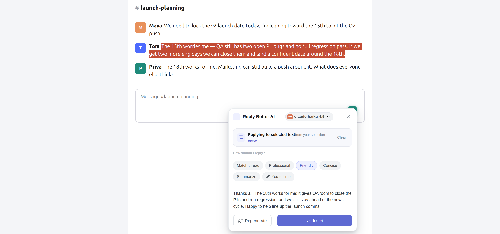
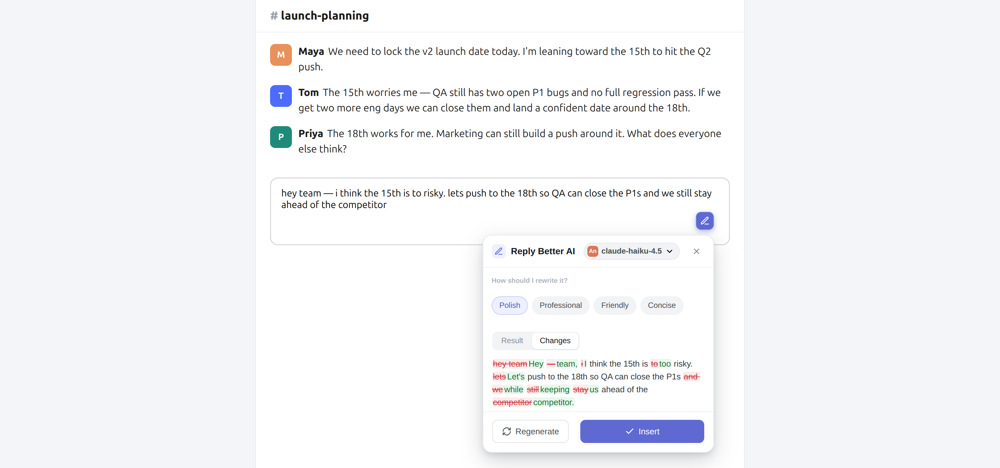
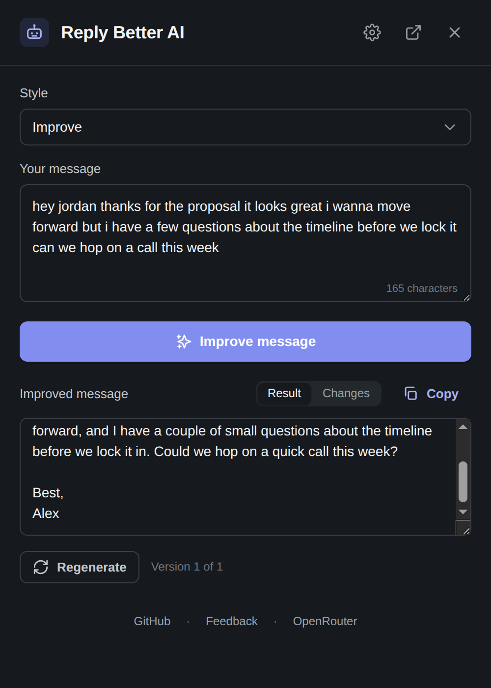
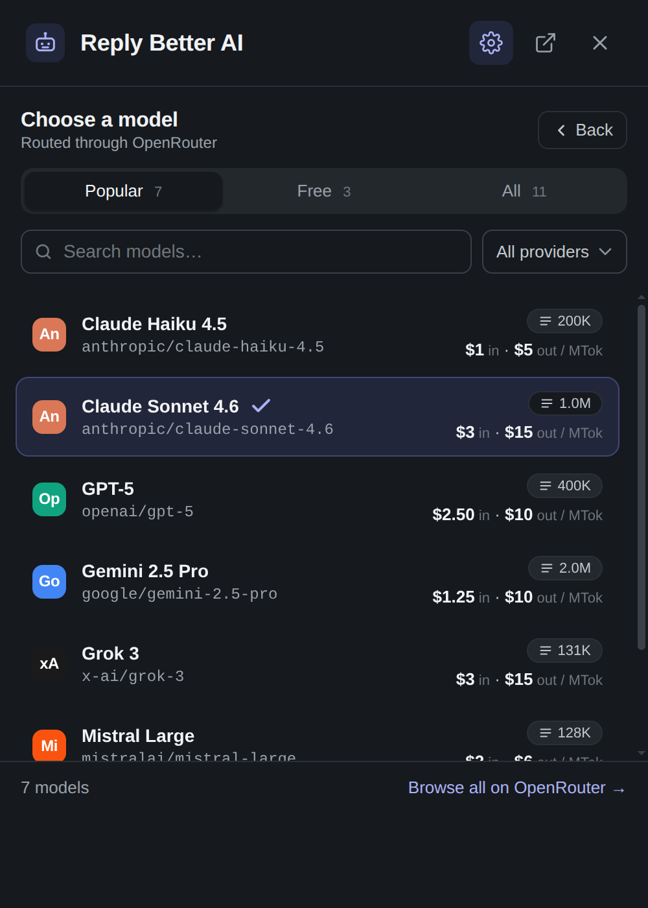

# Reply Better AI

Write better anywhere on the web, free and private, with the AI engine of *your* choice. Reply Better AI improves your drafts and helps you reply in context. It runs **free on-device** (Gemini Nano: no key, nothing leaves your computer) where your browser supports it, and falls back to a **free Groq key** or **500+ models on OpenRouter** (Claude, GPT, Gemini, DeepSeek, Llama, and more) with a searchable picker, free/paid filtering, and live pricing right inside the extension.

[](https://chromewebstore.google.com/detail/reply-better-ai/dpdibbijcljdjnafjnmaljphpkfojlkb)
[](https://addons.mozilla.org/en-US/firefox/addon/reply-better-ai/)
[](https://www.loom.com/share/b8781d769fb940d7a1d8aff09b6f1648?sid=26fb5f18-27af-4938-bbc9-fe952a3e211e)
[](https://github.com/dantnan/reply-better-ai)



## What it does

One small button rides along on any composer and **morphs to fit what you're doing**:

- **Reply mode** (speech bubble) — select the messages you're replying to, click, and pick how to respond: **Match thread · Professional · Friendly · Concise · Summarize**, or **You tell me** to type what to say in *any* language (the reply comes back in that language).
- **Improve mode** (pencil) — once you've typed a draft, the same button polishes it, with a word-level **Changes** diff so you can see exactly what was edited.

Everything streams live, you can **Regenerate** for another take, and **Insert** drops the result into the field with one-tap **Undo**.

| Improve + Changes diff | Streaming popup | Model picker |
|:---:|:---:|:---:|
|  |  |  |

## Features

- **Free, zero-setup engine** — on-device AI (Gemini Nano) runs locally with no key and no data leaving your computer, selected automatically when your browser supports it.
- **Your choice of engine** — on-device, your own local [Ollama](https://ollama.com)/[LM Studio](https://lmstudio.ai) server, a free [Groq](https://console.groq.com/keys) key, or OpenRouter's 500+ models. **Auto** picks the best available and falls back across them if one is unavailable; the active engine is always shown inline and in settings.
- **Context-aware inline button** — morphs between Reply and Improve based on what you've selected or typed; sits in the corner of the focused field.
- **Reply to a conversation** — selection-first context capture, tone presets, summarize, or a free-form instruction in any language.
- **Live streaming** — results type in as they're generated, in the popup and the inline panel alike.
- **Changes diff** — word-level additions/deletions between your draft and the rewrite.
- **Regenerate** — cycle fresh variations with a version counter.
- **Dynamic model picker** — Popular / Free / All tabs, search, provider filter, context window, and live per-token pricing.
- **Auto · Fastest free** — one pick that routes to the fastest available free model and fails over automatically when one is busy or errors (reasoning models excluded; shows which model answered).
- **Inline model switch + recovery** — swap models without leaving the page; when a free model is rate-limited, switch and retry in one tap.
- **Writing styles** — Improve, Professional, Friendly, Concise, Persuasive — plus your own custom prompts.
- **Snippets** — TextBlaze-style triggers (`/sig`, `/welcome`) that expand as you type in plain text fields.
- **Dark mode** — popup and options follow your system theme.
- **Cross-browser** — one source builds Chrome MV3 and Firefox MV3.
- **Privacy-first** — on-device mode sends nothing off your computer; cloud engines use only your own key (stored in `storage.local`) and contact only that provider; only the text you select is ever sent; zero telemetry.

## Install

### Chrome

[Reply Better AI on the Chrome Web Store](https://chromewebstore.google.com/detail/reply-better-ai/dpdibbijcljdjnafjnmaljphpkfojlkb) — install in one click.

To run an unreleased build instead: `npm install && npm run build`, then load the `dist/chrome/` folder via `chrome://extensions` → **Developer mode** → **Load unpacked**.

### Firefox

[Reply Better AI on AMO](https://addons.mozilla.org/en-US/firefox/addon/reply-better-ai/) — install in one click.

### Choose an engine

Open the extension's settings and pick an engine, or leave it on **Auto**:

- **On-device** — free and private, no key. Runs in Chrome (desktop) where Gemini Nano is available; the first use downloads the model once, then nothing leaves your computer.
- **Local (Ollama / LM Studio)** — free and private, no key, and works in any browser. Point the extension at your own [Ollama](https://ollama.com) or [LM Studio](https://lmstudio.ai) server (or any OpenAI-compatible local server) and pick from the models you've installed. See [docs/local-llm-setup.md](./docs/local-llm-setup.md) for setup, including the CORS step.
- **Groq** — free and fast. Create a free key at [console.groq.com/keys](https://console.groq.com/keys) and paste it in.
- **OpenRouter** — 500+ models, free and paid. Create a key at [openrouter.ai/keys](https://openrouter.ai/keys); free models are flagged in the picker, paid models bill per-token to your account.

**Auto** uses on-device when your browser supports it, otherwise your Groq key, otherwise OpenRouter. **Local** is opt-in — select it explicitly to use your own server.

## Usage

**Popup** — click the toolbar icon, paste or type your text, choose a style, then **Improve message**. Watch it stream, flip between **Result** and **Changes**, **Regenerate** for alternatives, and **Copy**.

**Inline — Improve** — start typing in any composer and a pencil button appears in the corner. Click it to open the panel (pick a style, see the diff, Insert), or switch the button to **instant rewrite** in settings for a one-click polish with Undo.

**Inline — Reply** — select the messages you're replying to anywhere on the page; the button turns into a speech bubble. Click it, then pick a tone, **Summarize**, or **You tell me** to type your intent in any language. Insert the drafted reply with one-tap Undo.

**Model switch** — the active model shows in the panel/popup header; click it to search and swap. Handy when a free model is busy: switch and it retries on the new one. Pick **Auto · Fastest free** to let OpenRouter route to the fastest available free model and fail over automatically — the best default if you're sticking to free models.

**Snippets** — in **Settings**, define triggers like `/welcome` that expand into longer text when typed.

## Develop

Requires Node 18+.

```bash
git clone https://github.com/dantnan/reply-better-ai
cd reply-better-ai
npm install
npm run build         # produces dist/chrome and dist/firefox
npm run watch         # rebuild on save
npm test              # vitest unit tests
npm run test:watch    # re-run tests on change
npm run package       # zips both dists for store submission
```

### Layout

```
src/
├── background/service-worker.js   # message handler, install/startup, stream relay
├── content/                        # injected into web pages
│   ├── index.js                    # orchestrator: morph button + mode detection
│   ├── button-injector.js          # the morphing Reply/Improve button + toasts
│   ├── panel.js                    # reply/improve panel: chips, diff, model switch
│   ├── content-button.css          # self-contained injected styles (theme-independent)
│   ├── reply-mode.css              # reply-panel additions
│   ├── snippet-expander.js
│   └── text-target.js              # textarea/contentEditable helpers
├── popup/                          # toolbar popup
│   ├── index.js
│   ├── popup.html / popup.css / model-picker.css
│   └── components/                 # ModelPicker.js, settings-ui.js
├── options/                        # full-tab settings page
│   ├── index.js
│   └── options.html / options.css
├── lib/                            # shared modules
│   ├── browser.js                  # webextension-polyfill re-export
│   ├── storage.js                  # storage.local wrapper + migration
│   ├── openrouter.js               # OpenRouter API client (improve + streaming)
│   ├── models-cache.js             # 1h TTL list + validation + formatting
│   ├── system-prompts.js           # style prompts + reply-mode prompt builder
│   ├── diff.js                     # word-level LCS diff
│   ├── sanitize.js                 # strips chatty model wrappers
│   ├── errors.js                   # typed error classes with userMessage
│   └── constants.js
├── shared/tokens.css               # design tokens + dark theme
└── data/popular-models.js          # curated "Popular" tab list
```

`build.mjs` bundles each entry with esbuild and emits per-browser
manifests (`manifest.chrome.json`, `manifest.firefox.json`) into
`dist/<browser>/`. The inline button never sees your API key — generation
streams through a service-worker port, so the key stays in the worker.

### Coding standards

Project conventions live in [`docs/coding-standards/`](./docs/coding-standards/):

- [Architecture](./docs/coding-standards/architecture.md)
- [JavaScript style](./docs/coding-standards/javascript-style.md)
- [Error handling](./docs/coding-standards/error-handling.md)
- [Security](./docs/coding-standards/security.md)
- [Testing](./docs/coding-standards/testing.md)

Read these before opening a PR.

## Privacy

Reply Better AI runs no servers and ships zero telemetry. Your API keys, prompts, and snippets stay in your browser. With the on-device or local (Ollama/LM Studio) engines, nothing ever leaves your computer. With a cloud engine, only the text you select (or explicitly capture) is sent, and the only network traffic is to the provider you chose (Groq or OpenRouter) when you ask for an improvement or a reply. See [docs/privacy.md](./docs/privacy.md) for the full policy.

## Credits

The Local engine (Ollama / LM Studio / OpenAI-compatible) was contributed by [@jtsternberg](https://github.com/jtsternberg). Reply Better AI is built and maintained by [@dantnan](https://github.com/dantnan), with thanks to everyone who has tried it and sent feedback.

## License

MIT — see [LICENSE](LICENSE).
